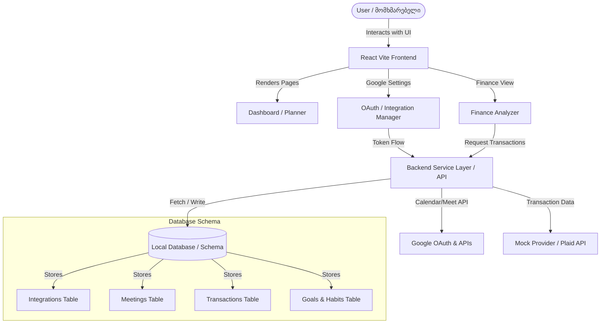

# Gonze: AI Life & Business Operating System - Technical Specification & PRD / ტექნიკური დავალება და პროექტის აღწერილობა

This document outlines the product requirements, architectural specifications, and implementation guidelines for Gonze, an AI-powered Life & Business Operating System.

ეს დოკუმენტი განსაზღვრავს პროდუქტის მოთხოვნებს, არქიტექტურულ სპეციფიკაციებსა და იმპლემენტაციის სახელმძღვანელო მითითებებს Gonze-სთვის, რომელიც წარმოადგენს ხელოვნური ინტელექტის მქონე Life & Business ოპერაციულ სისტემას.

---

## 1. Project Overview & Vision / პროექტის მიმოხილვა და ხედვა

### English:
Gonze is not just another simple AI planner. It is designed to be an AI Life & Business Operating System that plans, executes, and tracks life and business goals in a unified workspace. By integrating daily productivity with financial tracking, Google APIs (Calendar, Meet, Gmail), and AI-driven coaching, Gonze empowers users to manage their schedules, habits, and budgets from a single cohesive command center.

### ქართული:
Gonze არ არის კიდევ ერთი მარტივი AI planner-ი. იგი შექმნილია როგორც AI Life & Business Operating System (ცხოვრებისა და ბიზნესის ოპერაციული სისტემა), რომელიც გეგმავს, ასრულებს და აკონტროლებს ცხოვრებისეულ და ბიზნეს მიზნებს ერთიან სამუშაო სივრცეში. პროდუქტიულობის, ფინანსური ტრეკინგის, Google API-ების (Calendar, Meet, Gmail) და ხელოვნური ინტელექტის მწვრთნელის გაერთიანებით, Gonze მომხმარებლებს საშუალებას აძლევს მართონ თავიანთი განრიგი, ჩვევები და ბიუჯეტი ერთიანი მართვის პანელიდან.

---

## 2. Target Market & Competitor Analysis / სამიზნე ბაზარი და კონკურენტების ანალიზი

### English:
The productivity and life management market is highly fragmented. Competitors like Motion and Reclaim AI focus heavily on algorithmic scheduling. Others like LifeOS and Hey Kyra offer all-in-one planners but lack deep context-aware proactive feedback.
Here is how Gonze positions itself against the key competitors:

- **Motion (usemotion.com):** Strong AI scheduling and task organization, but lacks financial tracking, health metrics, or deeper habit analytics.
- **Reclaim AI (reclaim.ai):** Integrates tasks and habits into Google Calendar but does not address life goals, business objectives, or finances.
- **LifeOS (runlifeos.com) / Hey Kyra (heykyra.ai):** Combines habits, planners, and basic finance, but functions as a passive repository of information.
- **Gonze's Edge:** Proactive AI COO/CEO engine. Instead of users manually scheduling everything, they specify high-level goals (e.g., "Launch a VR space in 6 months"), and Gonze auto-generates action plans, populates calendars, tracks budgets, issues cost-saving alerts, and dynamically reviews performance.

### ქართული:
პროდუქტიულობისა და ცხოვრების მართვის ბაზარი საკმაოდ ფრაგმენტირებულია. ისეთი კონკურენტები, როგორიცაა Motion და Reclaim AI, ძირითადად ფოკუსირებული არიან ალგორითმულ დაგეგმვაზე. სხვები, როგორიცაა LifeOS და Hey Kyra, სთავაზობენ მომხმარებელს "ყველაფერი ერთში" პლანერებს, თუმცა აკლიათ პროაქტიული და კონტექსტზე ორიენტირებული უკუკავშირი.
Gonze-ის პოზიციონირება ძირითად კონკურენტებთან მიმართებაში:

- **Motion (usemotion.com):** ძლიერი AI დაგეგმვა და თასქების ორგანიზება, თუმცა არ გააჩნია ფინანსური მოდული ან ჩვევების სიღრმისეული ანალიტიკა.
- **Reclaim AI (reclaim.ai):** ახდენს თასქებისა და ჩვევების ინტეგრაციას Google კალენდარში, მაგრამ არ მოიცავს ცხოვრებისეულ, ბიზნეს მიზნებსა და ფინანსებს.
- **LifeOS (runlifeos.com) / Hey Kyra (heykyra.ai):** აერთიანებს ჩვევებს, პლანერსა და საბაზისო ფინანსებს, მაგრამ მუშაობს როგორც ინფორმაციის პასიური საცავი.
- **Gonze-ის უპირატესობა:** პროაქტიული AI COO/CEO მოდული. მომხმარებლის მიერ თითოეული თასქის ხელით გაწერის ნაცვლად, მომხმარებელი უთითებს გლობალურ მიზანს (მაგ. "VR სივრცის გახსნა 6 თვეში"), ხოლო Gonze თავად აგენერირებს სამოქმედო გეგმას, ავსებს კალენდარს, აკონტროლებს ბიუჯეტს, იძლევა რეკომენდაციებს ხარჯების შემცირებაზე და დინამიკურად აფასებს პროგრესს.

---

## 3. Core Modules & Functional Requirements / ძირითადი მოდულები და ფუნქციონალური მოთხოვნები

### Module A: Google Workspace Integration / Google Workspace ინტეგრაცია
#### English:
- **OAuth Connect Flow:** Secure authentication via Google Identity services. Users grant permission explicitly for Google Calendar (read/write) and Gmail (optional metadata or send invites).
- **Calendar Event & Meet Synchronization:** When creating a task, meeting, or event, the system offers one-click Google Calendar creation with automatic Google Meet link generation.
- **Gmail Invitations:** Automatically sends standardized email invitations and reminder updates to participants with event details.
- **Security:** Strict separation of client secrets, token-based state management, encrypted token storage at rest, and a clear revoke connection feature.

#### ქართული:
- **OAuth კავშირი:** უსაფრთხო ავტორიზაცია Google Identity სერვისების მეშვეობით. მომხმარებელი აძლევს წვდომას Google Calendar-ზე (წაკითხვა/ჩაწერა) და Gmail-ზე (არჩევითი მეტამონაცემები ან მოწვევების გაგზავნა).
- **კალენდრისა და Meet-ის სინქრონიზაცია:** თასქის, შეხვედრის ან ივენთის შექმნისას, სისტემა სთავაზობს მომხმარებელს Google კალენდარში ივენთის შექმნასა და Google Meet ბმულის ავტომატურ გენერირებას.
- **Gmail მოწვევები:** მონაწილეებისთვის შეხვედრის დეტალების მქონე სტანდარტული მოწვევებისა და შეხსენებების ავტომატური გაგზავნა მეილით.
- **უსაფრთხოება:** Client credentials-ის მკაცრი დაცვა, OAuth ტოკენების უსაფრთხო შენახვა და მომხმარებლისთვის წვდომის ნებისმიერ დროს გაუქმების შესაძლებლობა.

### Module B: AI-Powered Finance Analyzer / ხელოვნური ინტელექტის ფინანსური ანალიზატორი
#### English:
- **Modular Banking Architecture:** Abstraction layer (`FinancialProviderInterface`) that supports future Plaid, Salt Edge, or Open Banking APIs.
- **Mock Banking Provider:** High-fidelity simulation database containing realistic sample bank accounts, transactions, and categories for sandbox development.
- **Transaction Processing:** Automated categorization (e.g., Subscriptions, Food, Travel, Utilities), income/expense summaries, and cash flow analysis.
- **AI Insights Engine:** Generates active alerts and cost-saving recommendations based on historical spending behavior (e.g., "Food expenses up 23% this week").

#### ქართული:
- **მოდულური საბანკო არქიტექტურა:** აბსტრაქციის ფენა (`FinancialProviderInterface`), რომელიც მომავალში მარტივად დაუკავშირდება Plaid, Salt Edge ან Open Banking API-ებს.
- **Mock ბანკის პროვაიდერი:** რეალისტური სატესტო მონაცემების ბაზა, რომელიც შეიცავს საბანკო ანგარიშებს, ტრანზაქციებსა და კატეგორიებს დეველოპმენტისა და ტესტირების რეჟიმისთვის.
- **ტრანზაქციების დამუშავება:** ავტომატური კატეგორიზაცია (მაგ. Subscriptions, Food, Travel, Utilities), შემოსავლებისა და ხარჯების რეპორტები და ფულადი ნაკადების (cash flow) ანალიზი.
- **AI ფინანსური ანალიტიკა:** იძლევა პროაქტიულ გაფრთხილებებსა და რეკომენდაციებს ხარჯების ოპტიმიზაციისთვის მომხმარებლის ქცევაზე დაყრდნობით (მაგ. "კვების ხარჯები გაიზარდა 23%-ით ამ კვირაში").

### Module C: Integrated Planner, Tasks, & Habits / ერთიანი პლანერი, თასქები და ჩვევები
#### English:
- **Unified Dashboard:** Provides an aggregated view of today's calendar, key habits to complete, critical financial health scores, and urgent tasks.
- **Weekly Planner:** Weekly view mapping out high-level priorities and auto-distributing tasks across days to prevent cognitive overload.
- **Goal Engine:** Interactive tracker where users outline long-term goals (1-6 months), which the AI decomposes into daily habits and scheduled tasks.

#### ქართული:
- **ერთიანი მართვის პანელი (Dashboard):** აჩვენებს დღევანდელი კალენდრის, შესასრულებელი ჩვევების, ფინანსური ჯანმრთელობის ქულისა და კრიტიკული თასქების შეჯამებას.
- **კვირის პლანერი (Weekly Planner):** კვირეული ჭრილი, სადაც ხდება პრიორიტეტების განაწილება დღეების მიხედვით, რათა თავიდან იქნას აცილებული მომხმარებლის გადატვირთვა.
- **მიზნების მოდული (Goal Engine):** ინტერაქტიული სივრცე, სადაც მომხმარებელი წერს გრძელვადიან მიზნებს (1-6 თვე), ხოლო ხელოვნური ინტელექტი შლის მათ ყოველდღიურ ჩვევებად და კალენდარულ თასქებად.

---

## 4. Architectural & System Design / არქიტექტურა და სისტემის დიზაინი

### Database Schema Requirements / მონაცემთა ბაზის სქემის მოთხოვნები

#### English:
1. `integrations`: Stores user authorization metadata, active permissions, expiry tokens, and connected account emails.
2. `meetings`: Stores title, description, start_time, end_time, participants list, Google Calendar Event ID, and generated Google Meet URLs.
3. `transactions`: Stores financial transactions with ID, account_id, amount, currency, date, category, description, and status.
4. `financial_accounts`: Stores connected bank name, account type, balance, and validation state.

#### ქართული:
1. `integrations`: ინახავს მომხმარებლის ავტორიზაციის მეტამონაცემებს, აქტიურ უფლებებს, ტოკენების ვადებს და დაკავშირებულ იმეილებს.
2. `meetings`: ინახავს შეხვედრის სათაურს, აღწერას, დაწყებისა და დასრულების დროს, მონაწილეებს, Google Calendar Event ID-ს და გენერირებულ Google Meet ბმულს.
3. `transactions`: ინახავს ტრანზაქციებს - ID, ანგარიშის ID, თანხა, ვალუტა, თარიღი, კატეგორია, აღწერა და სტატუსი.
4. `financial_accounts`: ინახავს დაკავშირებული ბანკის სახელს, ანგარიშის ტიპს, ბალანსსა და ვალიდაციის სტატუსს.

---

## 5. Security & Compliance / უსაფრთხოება და შესაბამისობა

### English:
- **No Credentials Storage:** Never collect or store raw Google or banking passwords.
- **Restricted Scopes:** Request only the minimum required OAuth scopes (e.g., `calendar.events`).
- **Encrypted Data:** All stored tokens and sensitive transaction records must be encrypted at rest using industry-standard protocols.
- **Privacy Policy / Data Purge:** Provide clear disclosures about data usage and allow users to wipe all financial history and revoke third-party ties instantly.

### ქართული:
- **პაროლების შენახვის აკრძალვა:** სისტემამ არასდროს არ უნდა მოითხოვოს ან შეინახოს Google-ის ან საბანკო ანგარიშების რეალური პაროლები.
- **შეზღუდული წვდომა (Scopes):** მხოლოდ მინიმალური საჭირო OAuth უფლებების მოთხოვნა (მაგ. `calendar.events`).
- **მონაცემთა შიფრაცია:** ყველა შენახული ტოკენი და სენსიტიური ტრანზაქცია უნდა დაიშიფროს შენახვისას (at rest).
- **კონფიდენციალურობა და წაშლა:** მომხმარებელს უნდა ქონდეს სრული ინფორმაცია მონაცემების დამუშავებაზე და შეეძლოს ნებისმიერ დროს ყველა ფინანსური მონაცემის წაშლა და ინტეგრაციების გაუქმება.

---

## 6. Execution & Verification Plan / შესრულებისა და ვერიფიკაციის გეგმა

### English:
- **Milestone 1:** Refined Database Schema setup & Integration configuration pages.
- **Milestone 2:** Mock Banking engine development & categorization logic.
- **Milestone 3:** Google Calendar & Meet linkage simulation and OAuth workflow presentation.
- **Milestone 4:** AI Financial Insights engine integration & Unified Planner dashboard layout.
- **Validation:** Automated unit test coverage for transaction analysis and mock endpoint behavior; manual UI testing across layout breakpoints (mobile/desktop).

### ქართული:
- **ეტაპი 1:** მონაცემთა ბაზის სქემების გამართვა და ინტეგრაციების გვერდის ინტერფეისის მომზადება.
- **ეტაპი 2:** Mock საბანკო სისტემის აწყობა და ტრანზაქციების კატეგორიზაციის ლოგიკა.
- **ეტაპი 3:** Google Calendar & Meet კავშირის სიმულაცია და OAuth ავტორიზაციის პროცესის ჩვენება.
- **ეტაპი 4:** AI ფინანსური რეკომენდაციების გენერატორი და ერთიანი პლანერის მართვის პანელი.
- **ვერიფიკაცია:** ავტომატური იუნიტ ტესტები ტრანზაქციების ანალიზისა და mock API ენდპოინტებისთვის; რეპონსიულობის მანუალური ტესტირება დესკტოპ და მობილურ ეკრანებზე.
